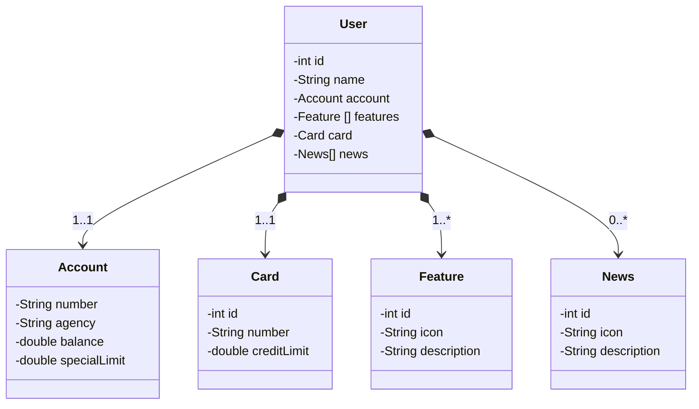

# Desafio Bootcamp Java com Spring DIO - Bank API

## Restfull API construída con fins didáticos no bootcamp Claro Java com Spring da DIO.

### Diagrama de Classes

```mermaid
classDiagram
    class User {
        -int id
        -String name
        -Account account
        -Feature [] features
        -Card card
        -News[] news
    }

    class Account {
        -String number
        -String agency
        -double balance
        -double specialLimit
    }

    class Feature {
        -int id
        -String icon
        -String description
    }

    class Card {
        -int id
        -String number
        -double creditLimit
    }

    class News {
        -int id
        -String icon
        -String description
    }

    %% Relacionamentos e cardinalidades
    User *--> Account : 1..1 
    User *--> Card : 1..1
    User *--> Feature : 1..*
    User *--> News : 0..*
```

